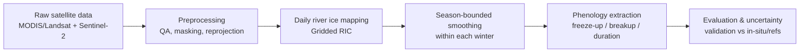

# Real-time River Ice Prediction through Integrated Remote Sensing and Monitoring, Water Digitalization course


**Author:** Jiahui Qiu  
**Contact:** Jiahui.Qiu@oulu.fi  
**Organization:** University of Oulu, Finland  
**Website:** https://www.linkedin.com/in/jiahui-qiu-a777661a7/  

---

## Project Overview

This repository supports part of my doctoral research on **river ice dynamics** and **near-real-time river ice prediction** using **multi-source remote sensing**, **in-situ monitoring**, and **AI-enabled digital twin** concepts.

### Problem statement (why this matters)
River ice strongly modulates cold-regions hydrology and infrastructure risk: it affects winter flow resistance, spring breakup floods, and **ice-jam hazards**, and it limits safe navigation and riverine operations. Reliable, timely river ice information is increasingly critical as climate warming shifts freeze-up/breakup timing and increases variability (Beltaos & Prowse, 2009; DOI: 10.1002/hyp.7165).

### Overarching challenge (why it is hard)
Operational river-ice monitoring and prediction remains difficult because river ice is:
- **spatiotemporally heterogeneous** (leads, frazil, intact cover, snow-on-ice, rubble),
- **intermittently observable** (clouds for optical sensors; polar night; mixed pixels),
- **dynamically forced** by coupled meteorology–hydrology–hydraulics processes, and
- under-observed at scale (in-situ gauges/cameras are sparse).

### Solution statement (what this research resolves)
This project develops an **integrated workflow** that:
1) generates **analysis-ready daily river ice concentration/extent** maps from remote sensing,  
2) extracts **ice phenology** (freeze-up, breakup, duration) using consistent hydrological-year indexing, and  
3) links these products to **AI-based predictive models** and (optionally) a **digital twin** for river ice state estimation and forecasting.

### Objective (how it will be accomplished)
- Build a reproducible pipeline from raw satellite + reanalysis + in-situ data to quality-controlled river ice products.
- Train and evaluate AI models for river ice state/phenology prediction (baseline → hybrid/assimilation-ready).
- Quantify uncertainty, sensitivity to observation gaps (clouds/polar night), and transferability across winters.

### Literature and foundations (methods-aligned)
Key foundations and method inspirations include:
- **Global extent of rivers and streams:** Allen, G.H. & Pavelsky, T.M. (2018). *Science*, 361(6402), 585-588  
- **Patterns and Trends in Northern Hemisphere River Ice Phenology from 2000 to 2021:** Wang, X. & Feng, L. (2024). *Remote Sensing of Environment*, 313, 114346
- ** Harmonized 2000–2024 Dataset of Daily River Ice Concentration and Annual Phenology for Major Arctic Rivers:** Qiu, J., et al. (2025), *Zenodo data set*, https://doi.org/10.5281/zenodo.17054619.

### Research questions (testable hypotheses)
1. **Data fusion hypothesis:** Fusing coarser optical (MODIS) + higher resolution (Landsat, Sentinel-2) reduces observation gaps and improves daily river-ice mapping accuracy compared with single-sensor products.  
2. **Phenology robustness hypothesis:** Applying season-bounded temporal smoothing (within each winter) improves phenology detection (freeze-up/breakup) stability without biasing event timing.  
4. **Polar-night correction hypothesis:** Explicit polar-night pixel correction increases the reliability of high-latitude daily products and reduces systematic missing-data artifacts in winter.

---

## Data Sources

### Study domain and period
- **Primary geographic focus:** 5 major Arctic rivers (initial emphasis on big rivers), with methods designed to generalize to other small rivers in Finland.  
- **Seasonal focus:** hydrological winter seasons spanning **Oct 1 → Apr 30** (per winter year), using multi-source optical products where available.  
- **Temporal smoothing rule:** any smoothing (e.g., 10-day moving average) is applied **within each individual winter season only**, never across adjacent winters.

### Published Data Sources

| Name | Source | Description | Access Method | DOI / URL | Notes |
|------|--------|-------------|---------------|-----------|-------|
| Global Lake and River Ice Phenology Database (G01377) | NSIDC | Historical freeze/thaw/breakup dates | NSIDC download / Earthdata login | https://doi.org/10.7265/N5W66HP8 | External phenology reference where applicable |
| MODIS Surface Reflectance (MOD09GA v6.1) | NASA LP DAAC / LAADS | Daily surface reflectance + QA | NASA Earthdata or Google Earth Engine | NASA product: https://ladsweb.modaps.eosdis.nasa.gov/missions-and-measurements/products/MOD09GA • GEE: https://developers.google.com/earth-engine/datasets/catalog/MODIS_061_MOD09GA | Cloud/QA filtering; daily gridded product |
| MODIS Snow Cover (MOD10A1 v6.1) | NASA / NSIDC | Daily 500 m snow cover & QA | NSIDC / GEE | NSIDC: https://nsidc.org/data/mod10a1 • GEE: https://developers.google.com/earth-engine/datasets/catalog/MODIS_061_MOD10A1 | Optional ancillary input |
| ERA5 reanalysis | ECMWF / Copernicus CDS | Hourly atmospheric variables | CDS API | CDS dataset: https://cds.climate.copernicus.eu/datasets/reanalysis-era5-single-levels | Driver features and benchmarking |

### Data access notes
Many sources require free accounts and/or tokens:
- **NASA Earthdata/NSIDC**: Earthdata login and credential configuration for scripted downloads.
- **Copernicus Data Space / Sentinel-2**: registration and access via web portal or APIs.
- **Copernicus CDS (ERA5)**: CDS account + API key (`~/.cdsapirc`).
- **Google Earth Engine (optional)**: authenticate if using GEE-based ingestion/export steps.

### Inputs folder
Small, repository-stored inputs may include:
- ROI polygons / simplified river corridor buffers,
- polar-night-affected area (vector).

---

## Methods Summary

**Model framework:** multi-source remote sensing → quality control → river ice state products → phenology extraction → trend analysis

### Workflow overview (Mermaid diagram)


### Key processing details (current implementation highlights)
- **GEE-based data export** for large-volume image preparation; exported rasters use:
  - outside ROI = **NaN** (invalid),
  - output type: **Float32**.
- **Polar night correction:** pixel correction driven by vector boundaries of polar-night-affected areas for each river basin.
- **Hydrological-year indexing for phenology module:**  
  - Freeze-up = first day where **RIC > 30%**.  
  - Breakup = first day where **RIC < 60% of the winter maximum** (winter maximum computed over **Nov 15 → Feb 15**).  
  - Outputs: `freezeup_DOY_new`, `breakup_DOY_new`, `ice_duration_new`, where DOY is computed with **Aug 1 = DOY 1**.

---

## Repository Structure

> Update this section as the repository matures. The table below reflects the intended organization.

| Folder/File | Description |
|-------------|-------------|
| `notebooks/` | Step-by-step notebooks (SE1–SE4): data access, preprocessing, mapping, phenology|
| `inputs/` | Small auxiliary inputs (`polygons`) |
| `processed_data/` | Analysis-ready datasets (intermediate rasters, mosaics) |
| `figures/` | Figures, tables, and derived products used in manuscripts/presentations |
| `src/` | Reusable Python modules for preprocessing, phenology extraction, and evaluation |
| `run_reproducibility.py` | One-command reproducibility wrapper (end-to-end pipeline, for Python tasks only) |
| `Dockerfile` | Container recipe for a reproducible runtime |
| `CITATION.cff` | Citation metadata (recommended for Zenodo/GitHub) |
| `LICENSE` | Project license |

---

## How to Reproduce

### Computational requirements
- OS: Linux/macOS/Windows
- CPU: ≥4 cores recommended; RAM: ≥16 GB recommended for multi-year mosaics

### Data access configurations
Configure credentials **before** running the pipeline:
- Earthdata/NSIDC credentials (for MODIS/NSIDC downloads)
- Copernicus/ASF credentials (for Sentinel-2 access)
- CDS API key (for ERA5)

### Run the code
```bash
python run_reproducibility.py
```

---

## Results

This repository is under active development; typical outputs include:
- **daily river ice concentration/extent maps** (cloud/polar-night aware),
- **phenology rasters**: `freezeup_DOY`, `breakup_DOY`, `ice_duration`,
- evaluation summaries (accuracy/error levels).

Display key figures in `/figures` folder, with description:


---

## License

**MIT License** (recommended for code).  
Third-party data remain under their original licenses/terms (e.g., NASA/NSIDC, Copernicus/ECMWF).

---

## Citation

If you use this code or derivatives in academic work:
1) cite the repository (Zenodo DOI recommended), and  
2) cite the key datasets/papers listed in **Literature and foundations**.

**DOI:** `DOI/url` (archiving on Zenodo)

BibTeX:
```bibtex
@dataset{qiu_river_ice_2025,
  author       = {Qiu, Jiahui},
  title        = {A harmonized 2000–2024 dataset of daily river ice concentration and annual phenology for major Arctic rivers},
  year         = {2025},
  publisher    = {Zenodo},
  doi          = {https://doi.org/10.5281/zenodo.17054619}
}
```

---

## Contribution Guidelines

Contributions that improve quality, clarity, and reproducibility are welcome.

- Open an issue before making major or result-affecting changes.
- Keep pull requests focused and clearly describe what changed and why.
- Follow existing code style and update documentation as needed.
- Do not commit large or restricted datasets; respect data licenses.
- Ensure workflows remain reproducible (environment, dependencies, random seeds).
- Do not modify code or data used to reproduce published results without discussion.
- By contributing, you agree that your work will be released under this project's license.

---